# 启动优化

## 屏幕白屏/黑屏

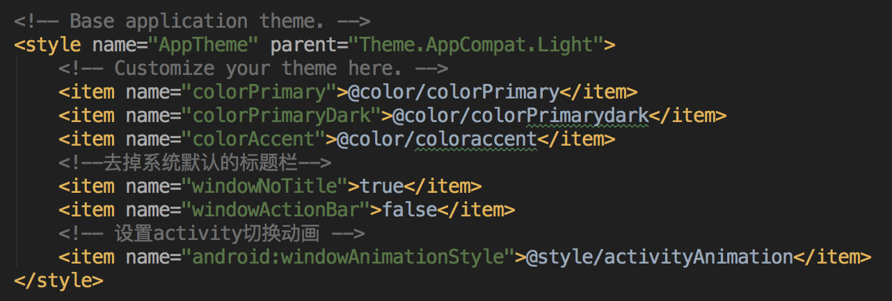

- 当parent使用的是 Theme.AppCompat.Light 时,如果启动项过多,有可能会出现白屏的现象
- 当parent不填写时,如果启动项过多,有可能会出现黑屏的现象

## Theme.AppCompat.Light

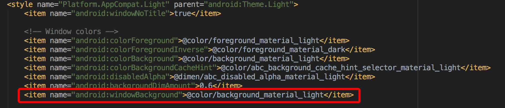

- <item name="android:windowBackground">@color/background_material_light</item>
- 父类定义了window的背景颜色为白色

## 如果获取APP的启动时间

### Android 4.4 版本后查询时间 (通过查询LogCat日志)

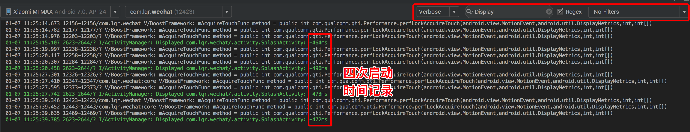

- 日志文件搜索 Display
- 以 ActivityManager 为 TAG 的 Log , 查询尾部的 +xms 代表页面的启动时间

### Android 通用查询时间(使用adb命令)

- adb shell am start -W 包名/全类名
- 例如 当前程序的包名为 com.lqr.wechat , 当前页面的名称为 com.lqr.wechat.activity.SplashActivity , 则命令为 adb shell am start -W com.lqr.wechat/com.lqr.wechat.activity.SplashActivity

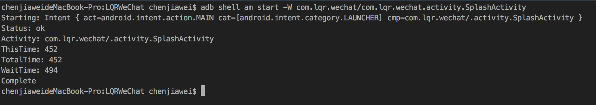

#### 时间含义

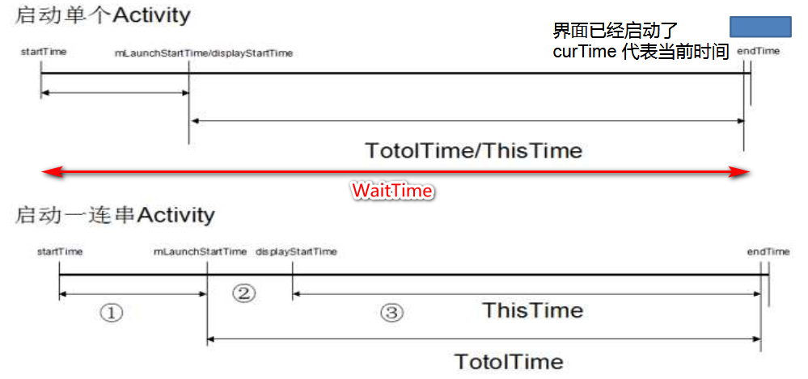

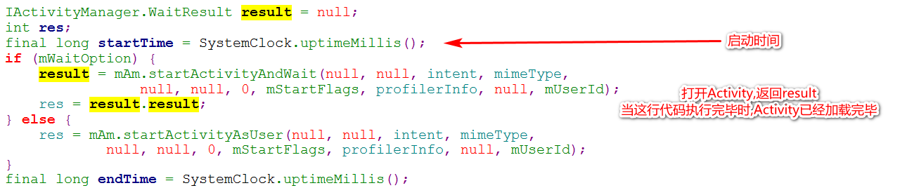

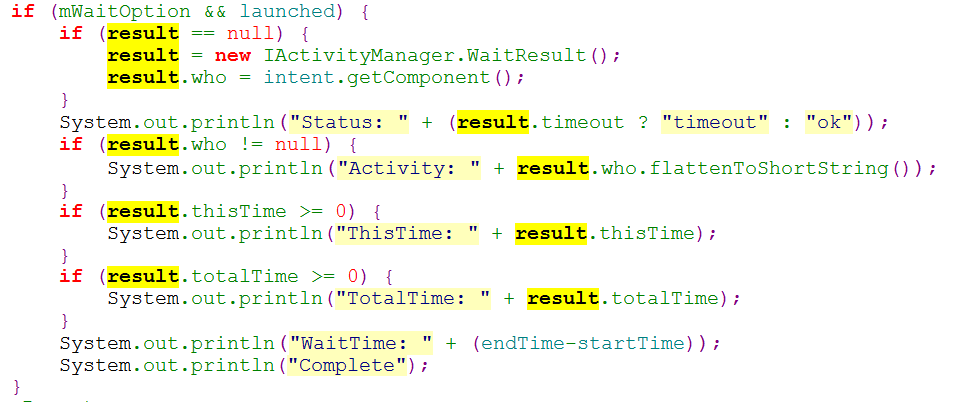

## 冷启动与热启动

### 冷启动

- 当启动应用时,后台没有该应用的进程,这时系统会重新创建一个新的进程分配给该应用

### 热启动

- 当启动应用时,后台已有该应用的进程(例:按back键/home键,应用虽然会退出,但是该应用的进程是依然会保留在后台,可进入任务列表查看),所以在已有进程的情况下,这种启动会从已有的进程中来启动应用

## 优化方案

- 方式一:为 WindowBackground 属性设置背景图片

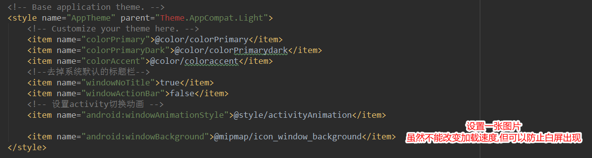

	缺点
	1. 每次打开一个启动比较慢的页面,都会显示设置的背景图片

- 方式二:只为启动页设置背景图片

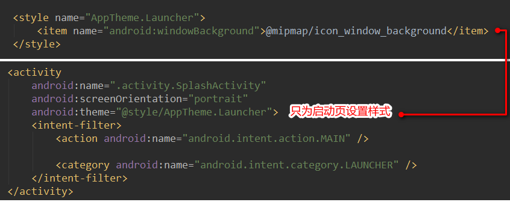

- 方式三:为 windowIsTranslucent 属性设置为 true

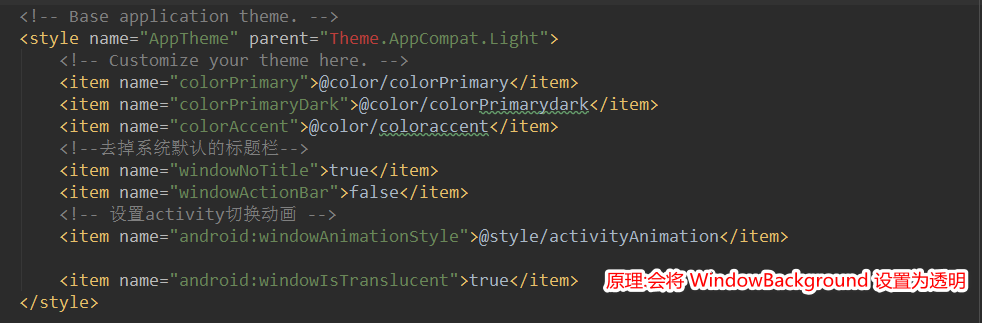

- 方式四:代码优化 减少耗时的操作

## 查看当前活跃的Activity

- 命令

		adb shell dumpsys activity activities

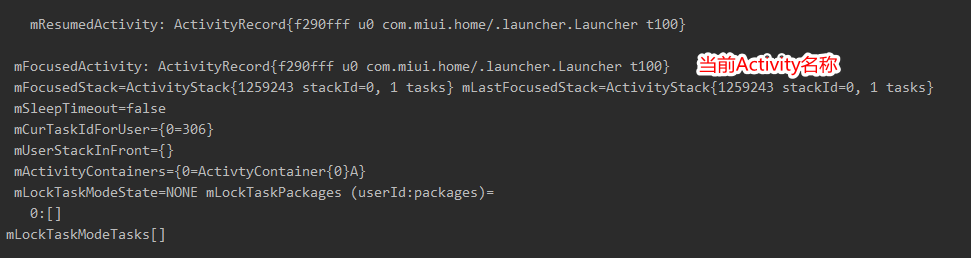

## App加载过程源码简要分析 ##

1. Launch 系统启动页面

	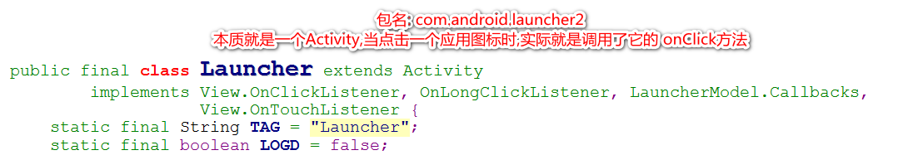

2. 点击事件的处理

	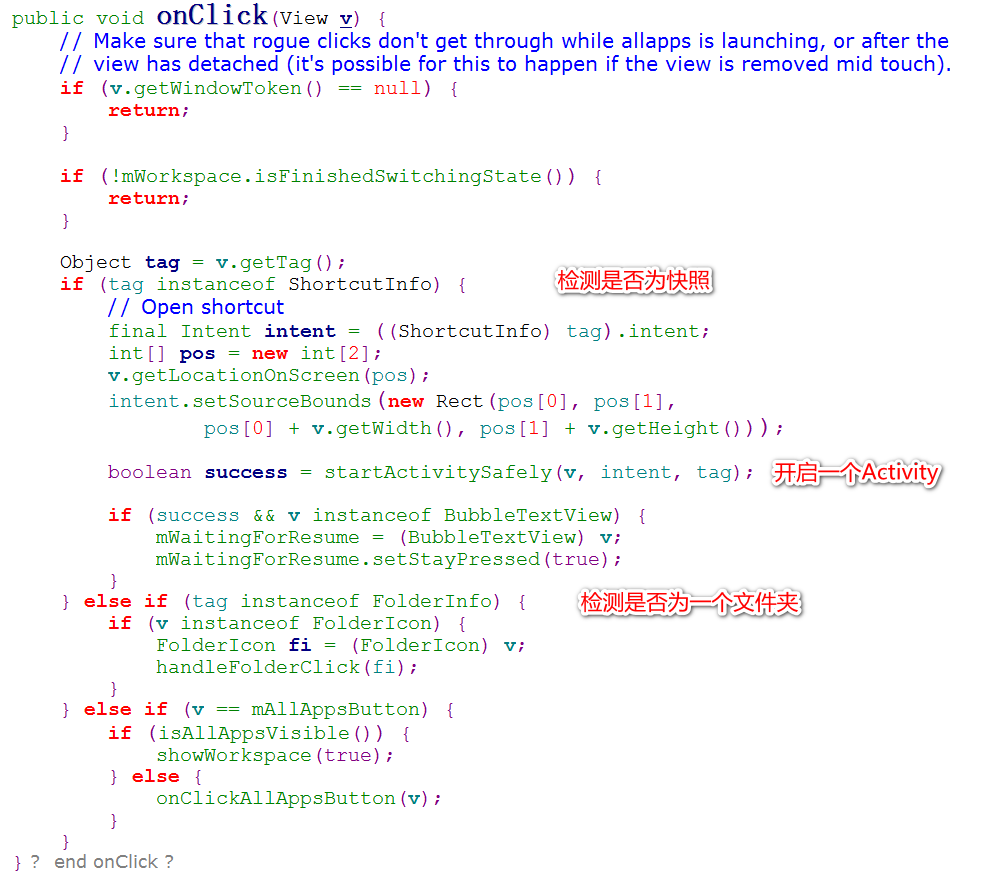

	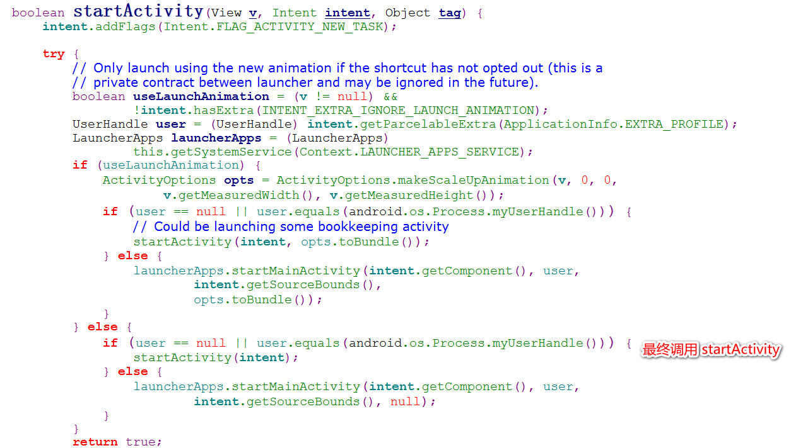

3. 开启一个Activity (冷启动方式启动)
	
	- 创建新的进程
	- 开闭内存空间
	- 执行 ActivityThread 的 main 函数
	- 执行 Application 的 onCreate 方法
	- 执行 Activity 的 onCreate 方法

4. ActivityThread 的 attach 方法

	

	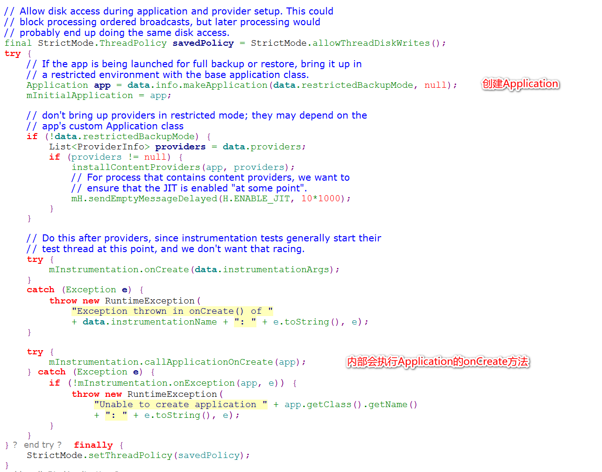

5. 优化的方向

	- 在 Application 的 onCreate 方法中减少耗时的操作
	- 在启动页 MainActivity 加载时减少耗时操作 (布局优化,减少耗时操作等)

## Trace 分析代码耗时的工具

- 代码设置

	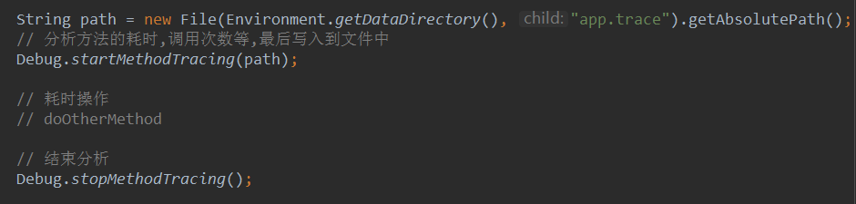

- 如果使用trace文件

	- 拖入到 Android Studio 中

		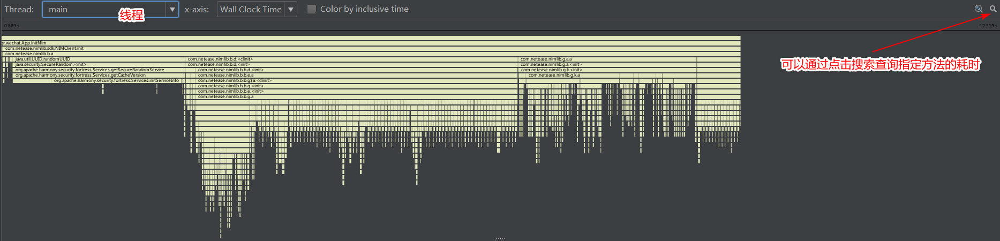

		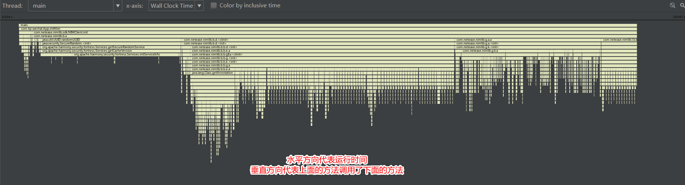

		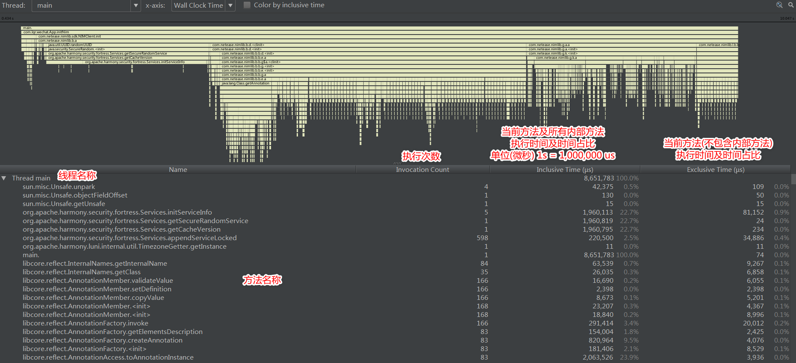