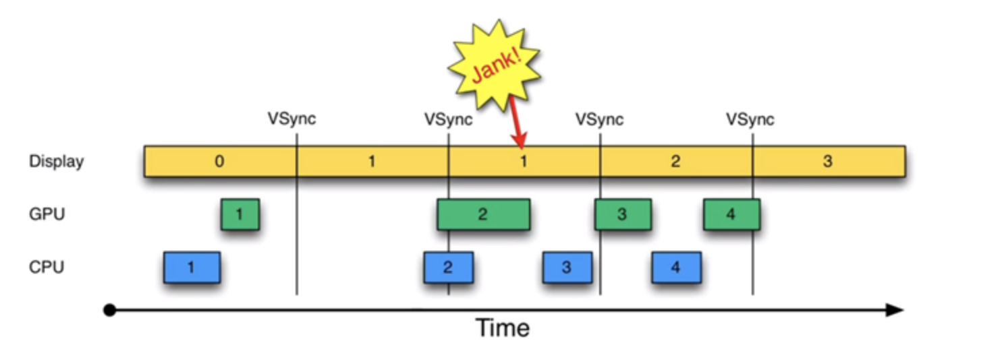
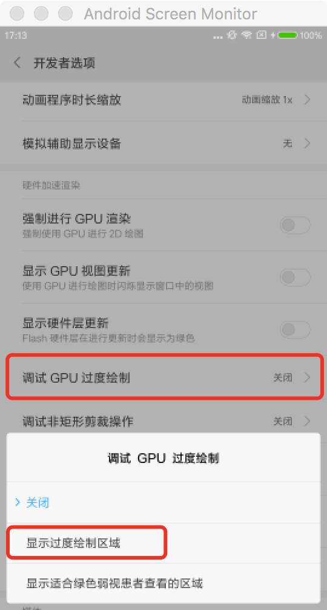
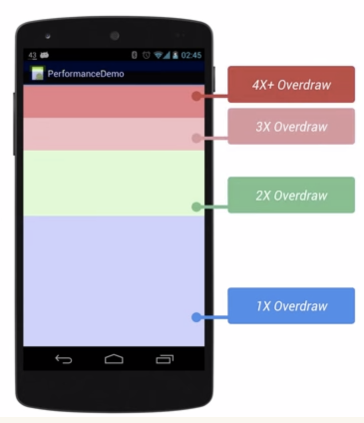
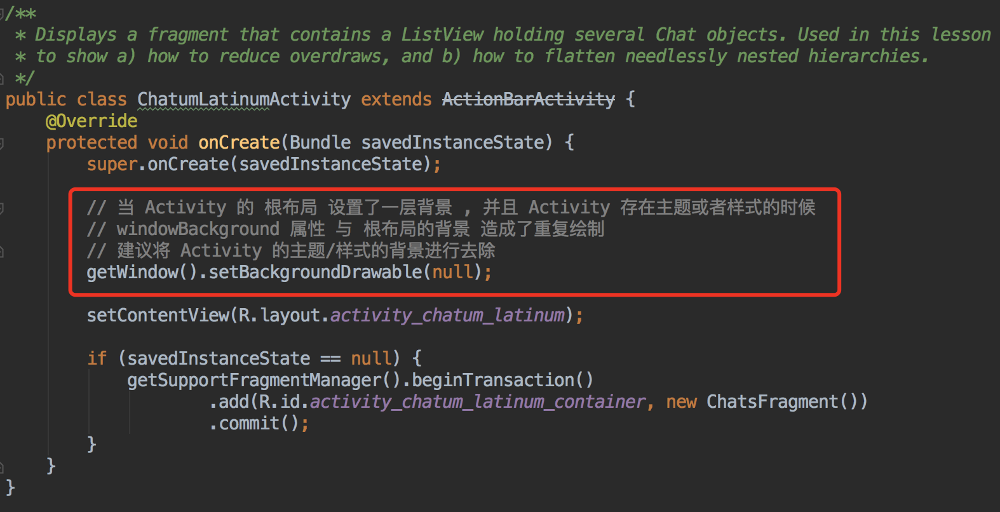
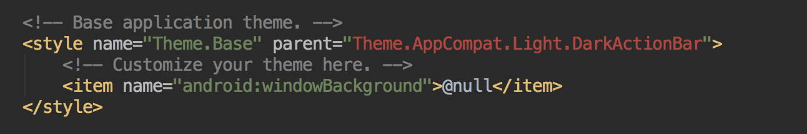
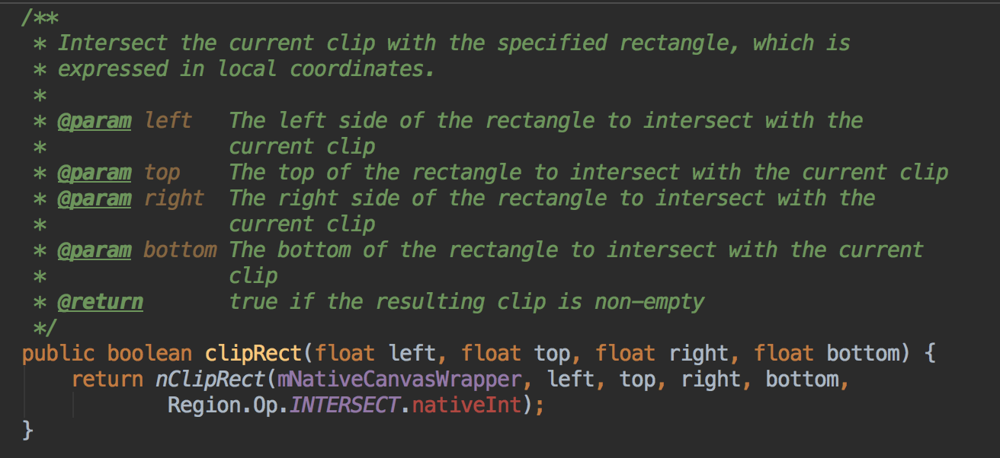
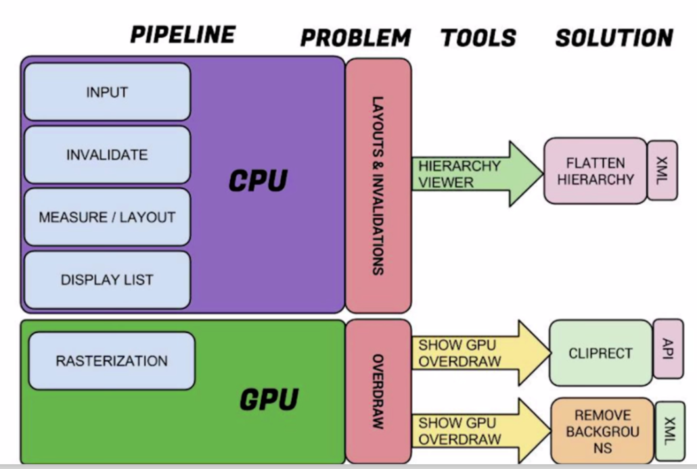
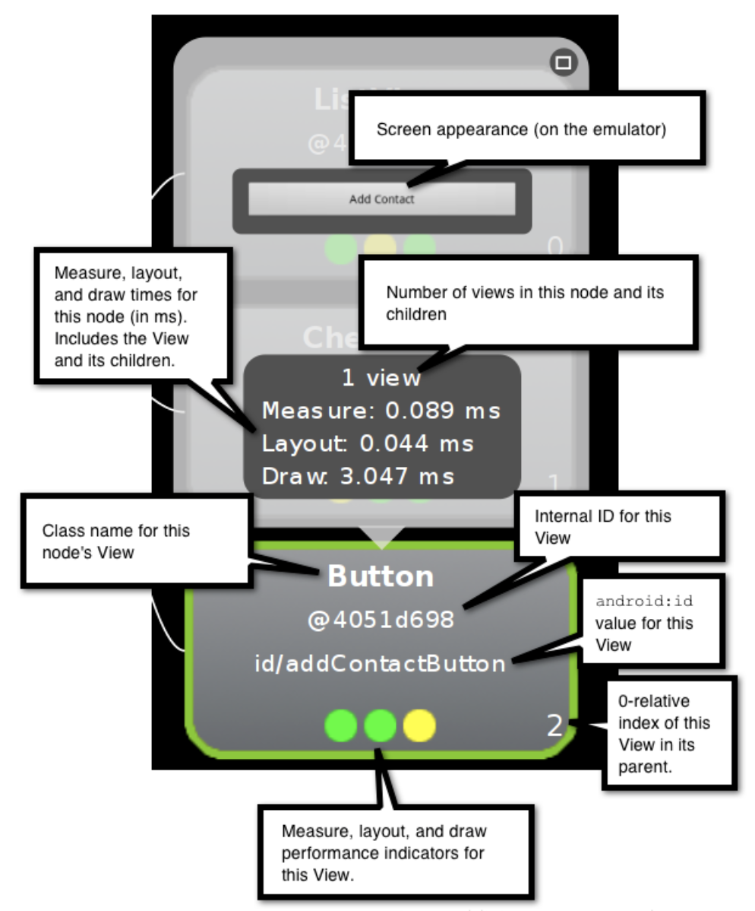
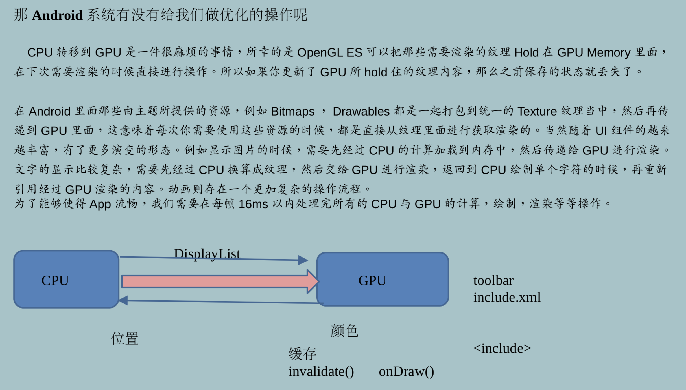

# 布局优化

## CPU与GPU

- GPU 擅长图形逻辑的运算
- CPU 擅长控制器取值及逻辑运算 , 但不适合于像素的运算

## 控件的加载流程 

- 获取 Xml 文件中的 Button , 通过 LayoutInflater 加载到内存 (实例化为一个 Button 对象 , 内部含有 left / right / top / bottom / background 等信息)
- Button 对象经过 CPU 运算处理成多维的向量图形
- 将向量图形交给 GPU , GPU 负责像素填充 (栅格化)
- 显示之前 , 会进行一次判断 , 如果之前的逻辑操作小于16ms , 则绘制该帧图像 , 如果之前的逻辑操作大于 16ms , 该帧图像不进行绘制 (卡顿) 

## VSYNC

- Android 系统每隔 16ms 发出 VSYNC 信号 , 触发UI进行渲染 , 如果每次渲染都成功 , 这样就能够达到流畅画面所需要的 60fps , 这代表计算渲染的大多数操作都应该在 16ms 内完成

## 卡顿原因分析

## 优化方向

### 16ms 主要处理的事情

- 将 UI 对象转换为多边形纹理
- CPU 传递处理数据到 GPU

### 方向

- CPU 减少 xml 转换为对象的时间
- GPU 减少重复绘制的时间 (减少重绘/过度绘制)

## 过度绘制

### 常见情况

- 自定义控件 onDraw 方法做了过多的重复绘制操作
- 布局层次太深 , 重叠性太强 , 用户开不到的区域 GPU 进行了渲染 , 导致耗时增加

### 查看工具

- 手机开发者模式中将 "调试GPU过度绘制" 开关打开

  

- 绘制层数及其对应颜色

  	

## 过度绘制的常见优化 (GPU优化 减少GPU的绘制)

1. 当 Activity 存在主题样式并且根布局设置了背景的情况

  - 方式一

    	

  - 方式二 (推荐)

    

2. 在自定义控件中 , 如果有重叠的操作 , 可以通过调用 Canvas.clipRect 方法 , 将 Canvas 进行剪裁

  

## 代码布局的优化 (CPU优化)

1. 从 UI 绘制流程 的角度

    

2. 工具 Hierarchy View 

    

## Android 系统所做的优化

- 类似于 ToolBar 控件 , 尽量保证只写一份文件 , 其他的 xml 通过 <include> 标签进行引入 , 不要每个 xml 都写一个 ToolBar , 这是因为 , 对于 <include> 所引入的 xml 文件 , GPU 都会做一个缓存 , 即只会加载一次 , 有效的减少了 CPU 向量化操作的时间