# 内存优化

## Java 内存模型

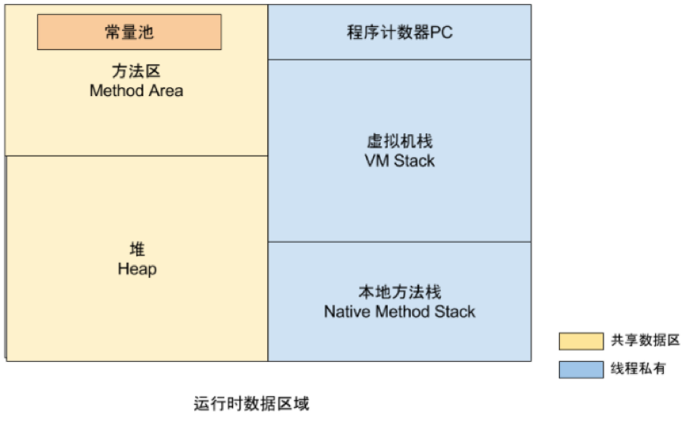

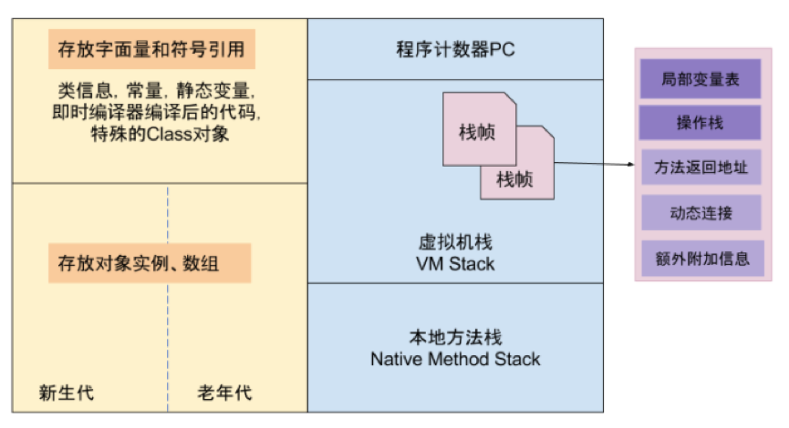

1. 程序计数器PC

   作用:指导程序运行代码的顺序(由JVM控制)

   Java虚拟机规范中唯一一块没有定义oom的区域

2. 虚拟机栈

   两个常见的异常:

   - stackOverFlow
   - oom

3. 本地方法栈

   与虚拟机栈类似,也有 stackOverFlow 与 oom 异常

4. 堆

   虚拟机管理最大的一块内存 , 依靠 GC 来进行回收内存

5. 方法区

   存放 class , 常量 , 静态变量 , 即时编译器编译后的代码

## GC

1. 如何确定一个对象是否被回收
   - 引用计数 (早期 JAVA 版本)

     ```
     Object obj1 = new Object();	// 此时 obj1 的 引用计数 为 1
     Object obj2 = new Object();
     obj2.o = obj1;	// 此时 obj1 的 引用计数为 2

     // 存在的问题
     // 假如
     obj1.o = obj2;	// 此时 obj1 和 obj2 的 引用计数都为 2
     obj1 = null;	// obj1 的 引入计数减去1,此时为1,不为0,无法被回收

     // 缺点
     // 如果对象相互引用 , 计数器永远不为 0 , 对象无法被回收
     ```

   - 可达性分析算法

     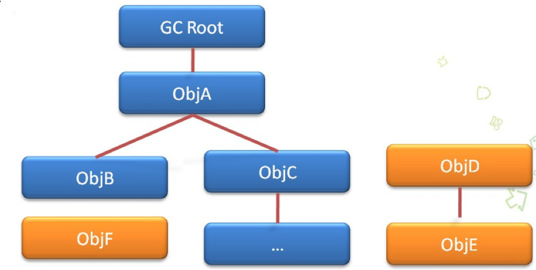

## GC Root

1. 哪些对象会被 GC Root 所引用
   - 虚拟机栈 正在运行使用的引用
   - 静态属性 常量
   - JNI 引用的对象
2. Java Object 类 finalize 方法
   - 当一个对象经过可达性分析算法后被认定为是需要进行回收时,第一次进行回收操作之前会先调用 finalize 方法
   - 如果在 finalize 方法中将该对象重新赋值给一个被 GC Root 引用对象,那么该对象相当于进行了一次自救 , 不会被 GC Root 回收

## Java 的四种引用

- 强引用

  ```
  Object obj = new Object();
  ```

- 软引用 SoftReference

  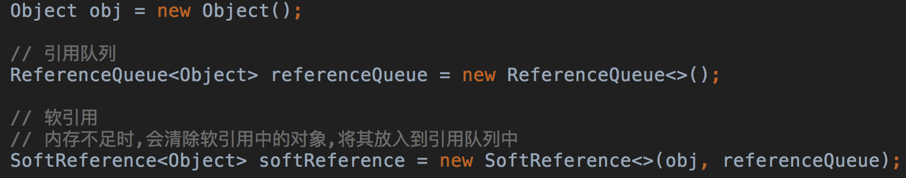

  有用,但不是一定必须存在的对象

  在内存不足的时候,会将软引用进行回收

- 弱引用 WeakReference

  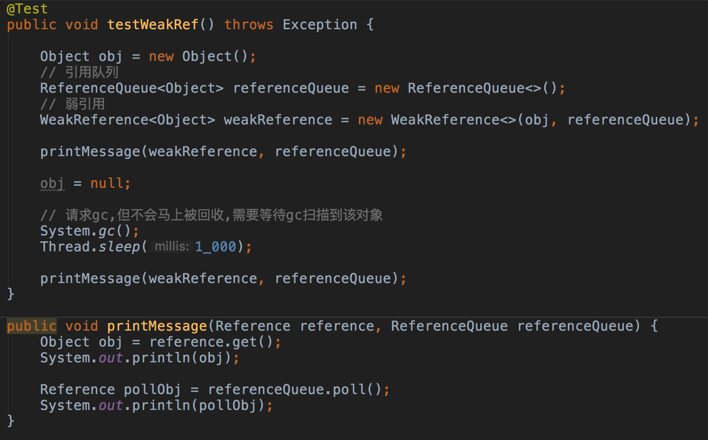

  有用,但不是一定必须存在的对象

  如果GC扫描到对象为弱引用,会直接回收该对象

- 虚引用

  不会对生存造成任何影响

  无法获取对象,只是能够在回收的时候,收到通知

## 内存泄漏

1. 根本原因
   - 长生命周期对象拥有短生命周期对象的引用,使短生命周期对象无法被回收
   - 需要回收的对象因为引用问题无法被回收

2. 使用 Android Studio 的 profile 检测内存

   - 工具栏介绍

     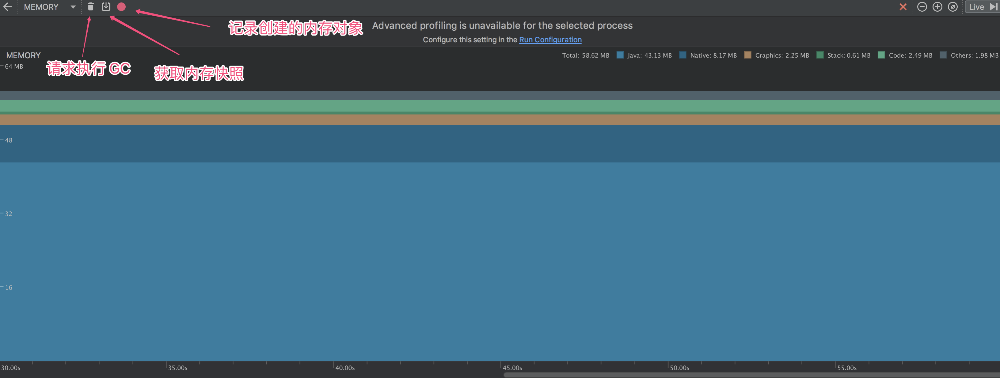

   - 捕获当前的快照,分析对象占用大小

     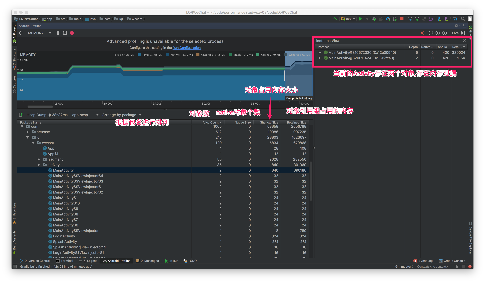

   - 快照文件导出

     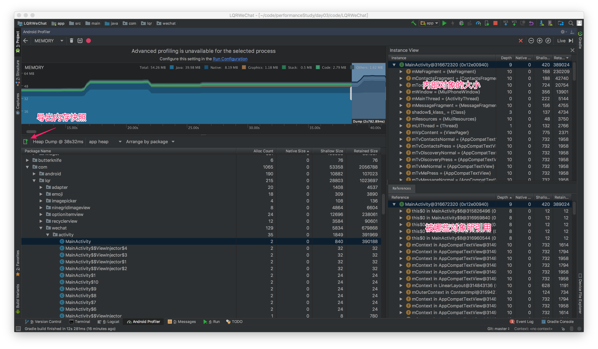

   - 通过 Android Studio 分析快照文件

     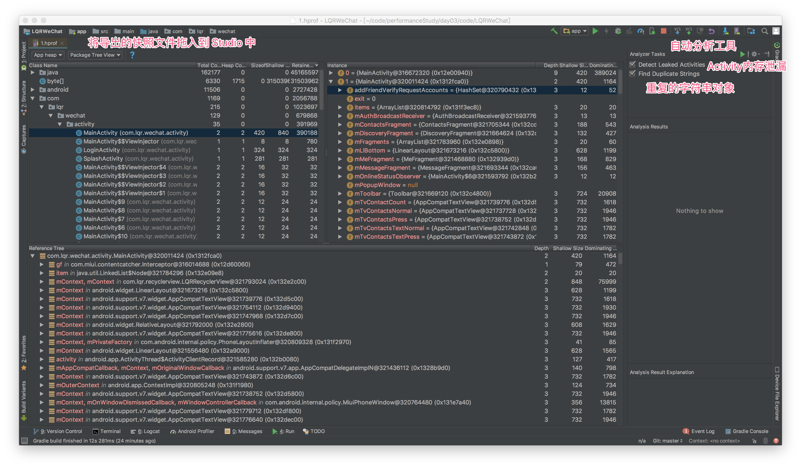

     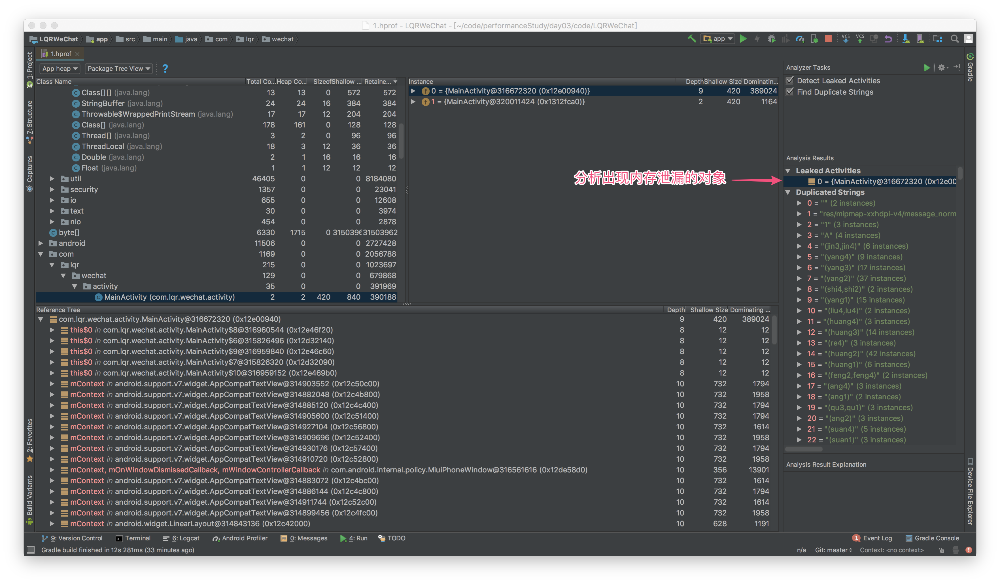

   - 通过 MAT 工具分析内存泄漏

     - 先必须通过 Android SDK 工具的 hprof-conv (在 platform-tools 目录中) 先将 hprof 文件进行一次转换

     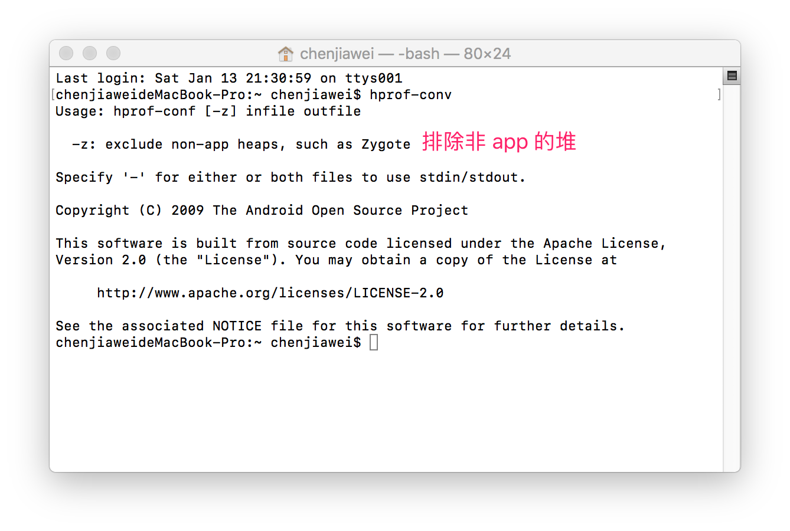

     - 转换命令

     ```
     hprof-conv -z 原hprof文件 新hprof文件
     ```

     - MAT 工具地址

     https://www.eclipse.org/mat/downloads.php

