# 使用弱引用避免 Handler 内存泄漏 #

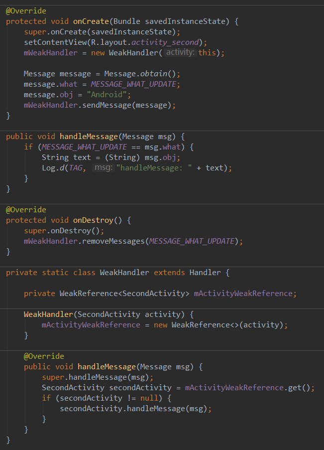

# 内存抖动 #

- 内存抖动是指内存频繁地分配和回收，而频繁的gc会导致卡顿，严重时和内存泄漏一样会导致OOM

# 垃圾回收 #

- 在对对象进行回收前需要对垃圾进行采集，不同的虚拟机实现可能使用不同的垃圾收集算法，不同的收集算法的实现也不尽相同。不同的算法各有各的优劣势

## 常见对的垃圾回收算法 ##

### 标记-清除算法 ###

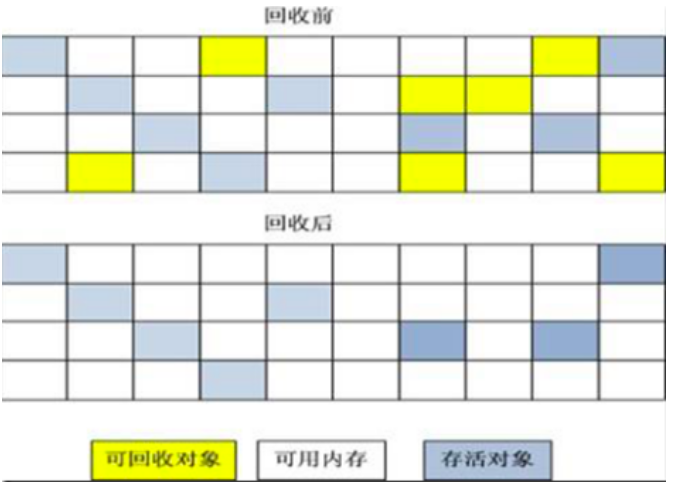

- 算法分为标记和清除两个阶段:首先标记出所有需要回收的对象，在标记完成后统一回收被标记的对象
- 标记-清除算法不会进行对象的移动，直接回收不存活的对象，因此会造成内存碎片
- 根据上图，比如我们回收后，如果我需要创建一个占了10个格子的内存大小的对象，这种情况，oom了。因为虽然我们现在有这么大的内存可以使用，但是没有连续的这么大的内存

### 复制算法 ###

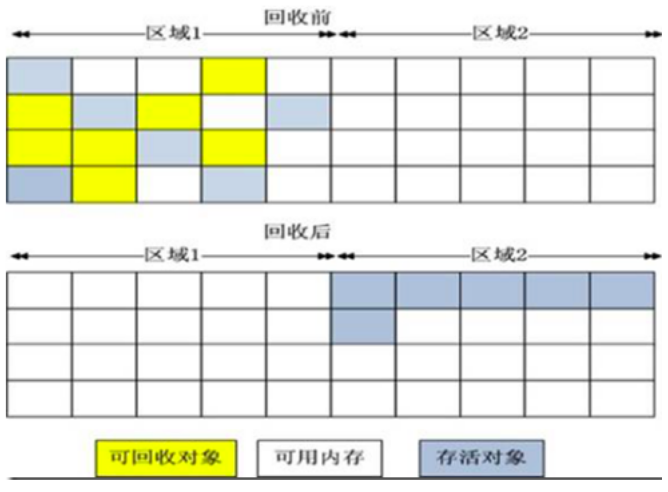

- 它将可用内存按容量划分为大小相等的两块，每次只使用其中的一块。当这一块的内存用完了，就将还存活着的对象复制到另外一块上面，然后再把已使用过的内存空间一次清理掉
- 这样使得每次都是对其中的一块进行内存回收，内存分配时也就不用考虑内存碎片等复杂情况，只要移动堆顶指针，按顺序分配内存即可，实现简单，运行高效。只是这种算法的代价是将内存缩小为原来的一半，持续复制长生存期的对象则导致效率降低
- 复制收集算法在对象存活率较高时就要执行较多的复制操作，效率将会变低。更关键的是，如果不想浪费50%的空间，就需要有额外的空间进行分配担保，以应对被使用的内存中所有对象都100%存活的极端情况

### 标记压缩算法 ###

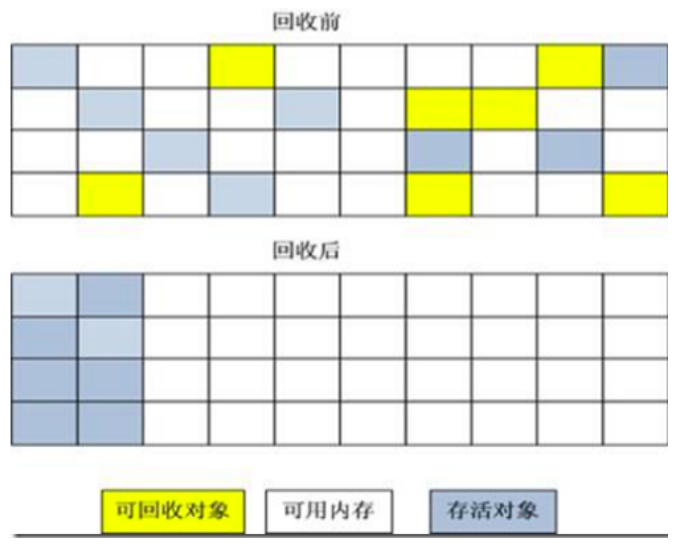
​	
- 标记过程仍然与“标记-清除”算法一样，但后续步骤不是直接对可回收对象进行清理，而是让所有存活的对象都向一端移动，然后直接清理掉端边界以外的内存
- 标记-压缩算法虽然缓解的内存碎片问题，但是它也引用了额外的开销，比如说额外的空间来保存迁移地址，需要遍历多次堆内存等

### 分代收集算法 ###

- 分代的垃圾回收策略，是基于不同的对象的生命周期是不一样的。因此，不同生命周期的对象可以采取不同的收集方式，以便提高回收效率
- 在不进行对象存活时间区分的情况下，每次垃圾回收都是对整个堆空间进行回收，那么消耗的时间相对会很长，而且对于存活时间较长的对象进行的扫描工作等都是徒劳。因此就需要引入分治的思想，所谓分治的思想就是因地制宜，将对象进行代的划分，把不同生命周期的对象放在不同的代上使用不同的垃圾回收方式

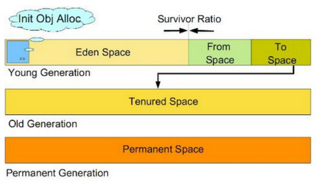

- 现在主流的做法是将Java堆被分为新生代和老年代和持久代
- 新生代又被进一步划分为 Eden 和 Survivor 区， Survivor 由From Space和To Space组成
- 一般来说，在新生代中，每次垃圾收集时都发现有大批对象死去，只有少量存活，所以一般选用复制算法，只需要付出少量存活对象的复制成本就可以完成收集。
  而老年代中因为对象存活率高、没有额外空间对它进行分配担保，就必须使用“标记-清理”或“标记-整理”算法来进行回收

#### 新生代 ####

- 新建的对象都是用新生代分配内存，当Eden满时，会把存活的对象转移到两个Survivor中的一个，当一个Survivor满了的时候会把不满足晋升的对象复制到另一个Survivor
- 晋升的意思是对象每经历一次Minor GC (新生代中的gc),年龄+1,年龄达到设置的一个阀值后，被放入老年代
- 两个Survivor的目的是避免碎片。如果只有一个Survivor，那Survivor被执行一次gc之后，可能对象是A+B+C。经历一次GC后B被回收。则会A| |C，造成碎片

#### 老年代 ####

- 用于存放新生代中经过N次垃圾回收仍然存活的对象
- 老年代的垃圾回收称为Major GC。整堆包括新生代与老年代的垃圾回收称之为Full GC

#### 永久代 ####

- 主要存放所有已加载的类信息，方法信息，常量池等等。并不等同于方法区，只不过是主流的日公司的Hotspot JVM用永久带来实现方法区而已，有些虚拟机没有永久带而用其他机制来实现方法区。这个区域存放的内容与垃圾回收要回收的Java对象关系并不大

# 垃圾收集器 #

- 垃圾收集算法是内存回收的概念，那么垃圾收集器就是内存回收的具体实现。Java 虚拟机规范对如何实现垃圾收集器没有任何规定，所以不同的厂商、不同版本的虚拟机提供的垃圾收集器可能会有很大差别

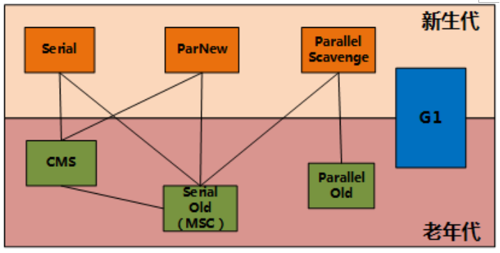

## 主要串行收集器 ##

### Serial串行收集器 ###

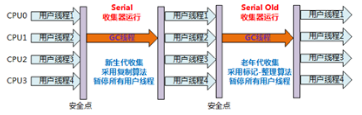

- 最基本，历史最悠久的收集器。曾经是jvm新生代的唯一选择。这个收集器是一个单线程的
- 在进行垃圾收集时，必须暂停其他所有的工作线程，直到收集结束才能继续执行
- 它的缺点也很明显，会‘Stop The World’。也就是会把我们的程序暂停
- 但是单线程也意味着它非常简单高效，没有多余的线程交互，专心收垃圾就可以了。所以在 client 版本的 java 中是默认的新生代收集器

### ParNew 收集器 ###

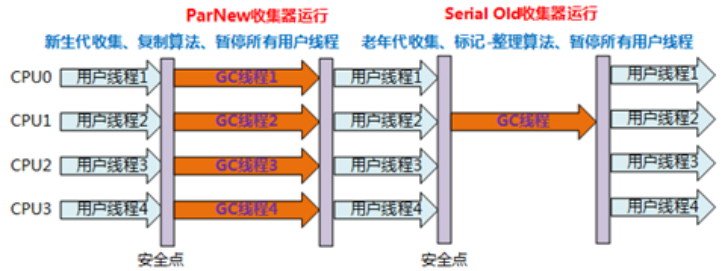

- Serial收集器的多线程版本，除了使用多线程进行垃圾收集之外。其他的行为和Serial一样
- ParNew收集器是server版本的虚拟机中首选的新生代收集器。因为除了Serial就他可以和CMS配合

### Parallel Scavenge收集器 ###

- 同样是新生代的收集器，也同样是使用复制算法的，并行的多线程收集器
- 而它与ParNew等其他收集器差异化的地方在于，它的关注点在控制吞吐量，也就是cpu用于运行用户代码事件于cpu总消耗时间的比值
- 吞吐量=运行用户代码时间/(运行用户代码时间+垃圾收集时间)。虚拟机总共运行100分钟，其中垃圾回收花掉1分钟，则吞吐量为 99/99+1 = 99%
- 而吞吐量越高表示垃圾回收时间占比越小，cpu利用效率越高
- 所以这个收集器也被称为”吞吐量收集器”. 高吞吐量为目标，即减少垃圾收集时间，让用户代码获得更长的运行时间

### Serial Old收集器 ###

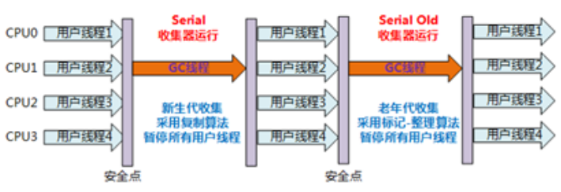

- 老年代版本的串行收集器，使用标记整理算法

### Parallel Old收集器 ###

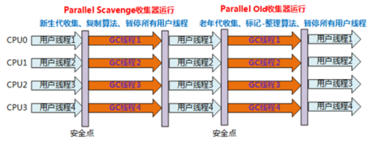

- 多线程采集，标记整理算法

### CMS 收集器 (Android 目前使用的收集器) ###

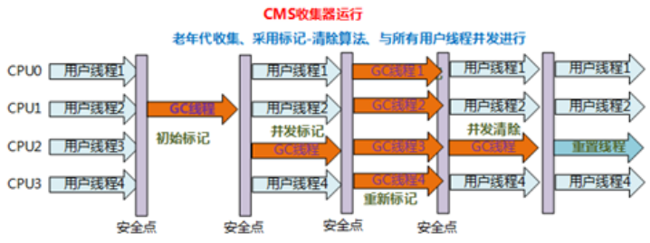

- Concurrent Mark Sweep收集器是一种以获得最短回收停顿事件为目标的收集器，也称为并发低停顿收集器或低延迟垃圾收集器.使用的是标记清除算法

#### 四个步骤 ####

1. 初始标记（CMS initial mark）

  - 仅标记一下GC Roots能直接关联到的对象，速度很快；但需要"Stop The World"

2. 并发标记（CMS concurrent mark）

  - 进行GC Roots 追踪的过程；刚才产生的集合中标记出存活对象
  - 应用程序也在运行；并不能保证可以标记出所有的存活对象 

3. 重新标记（CMS remark）

  - 为了修正并发标记期间因用户程序继续运作而导致标记变动的那一部分对象的标记记录
  - 需要"Stop The World"，且停顿时间比初始标记稍长，但远比并发标记短；
    采用多线程并行执行来提升效率

4. 并发清除（CMS concurrent sweep）

  - 回收所有的垃圾对象

### 总结 ###

- 由于整个过程中耗时最长的并发标记和并发清除过程收集器线程都可以与用户线程一起工作，所以，从总体上来说，CMS收集器的内存回收过程是与用户线程一起并发执行的
- CMS是一款优秀的收集器，它的主要优点在名字上已经体现出来了：并发收集、低停顿

#### CMS缺点 ####

1. 造成CPU资源紧张,会比其他收集器多开线程
2. 无法处理浮动垃圾

  - 由于CMS并发清理阶段用户线程还在运行着，伴随程序运行自然就还会有新的垃圾不断产生，这一部分垃圾出现在标记过程之后，CMS无法在当次收集中处理掉它们，只好留待下一次GC时再清理掉。这一部分垃圾就称为“浮动垃圾”
  - 因此CMS收集器不能像其他收集器那样等到老年代几乎完全被填满了再进行收集，需要预留一部分空间提供并发收集时的程序运作使用
  - 要是CMS运行期间预留的内存无法满足程序需要，就会出现一次“Concurrent Mode Failure”失败，这时虚拟机将启动后备预案：临时启用Serial Old收集器来重新进行老年代的垃圾收集，这样停顿时间就很长了

3. 大量内存碎片,来源“标记—清除”算法

### G1收集器 ###

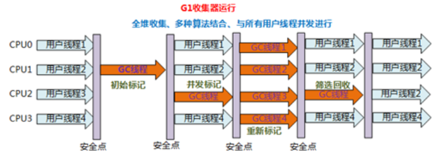

- Garbage-First收集器是当今收集器技术发展最前沿的成果之一，是一款面向服务端应用的垃圾收集器
- 图中可以看到和 CMS差不多，但是G1的采集范围是整个堆(新生代老生代)。他把内存堆分成多个大小相等的独立区域，在最后的筛选回收的时候根据这些区域的回收价值和成本决定是否回收掉内存

## 总结 ##

- Java 虚拟机是一个规范，任何实现该规范的虚拟机都可以用来执行 Java 代码。android就是觉得现在使用的jvm用着不爽，由于 Androd 运行在移动设备上，内存以及电量等诸多方面跟一般的 PC 设备都有本质的区别 ，一般的 JVM 没法满足移动设备的要求，所以自己根据这个规范开发了一个Dalvik 虚拟机
- Dalvik虚拟机主要使用标记清除算法，也可以选择使用拷贝算法。这取决于编译时期

[http://androidxref.com/4.4_r1/xref/dalvik/vm/Dvm.mk](http://androidxref.com/4.4_r1/xref/dalvik/vm/Dvm.mk)

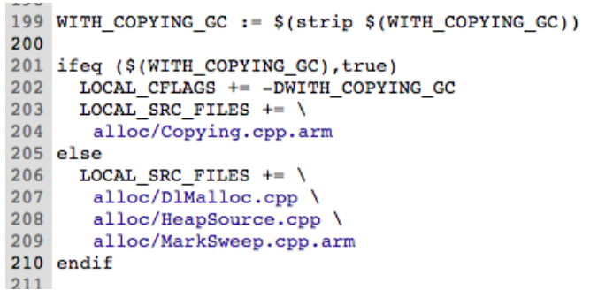

- ART 是在 Android 4.4 中引入的一个开发者选项，也是 Android 5.0 及更高版本的默认 Android 运行时。google已不再继续维护和提供 Dalvik 运行时，现在 ART 采用了其字节码格式
- ART 有多个不同的 GC 方案，这些方案包括运行不同垃圾回收器。默认方案是 CMS

[https://source.android.com/devices/tech/dalvik/gc-debug?hl=zh-cn](https://source.android.com/devices/tech/dalvik/gc-debug?hl=zh-cn)

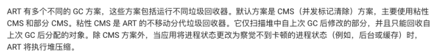

# 内存抖动的检测与优化 #

## 内存抖动的表现形式 ##

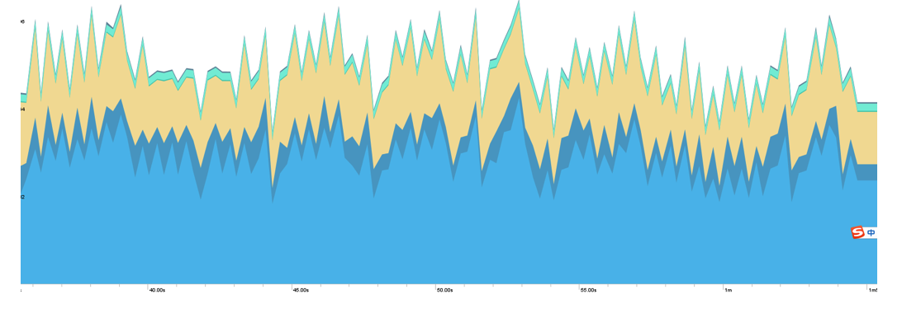

- 内存抖动的问题我们可以通过Alloctions Tracker来进行排查
- 在Android Studio中点击memory profiler中的红点录制一段时间的内存申请情况，再点击结束

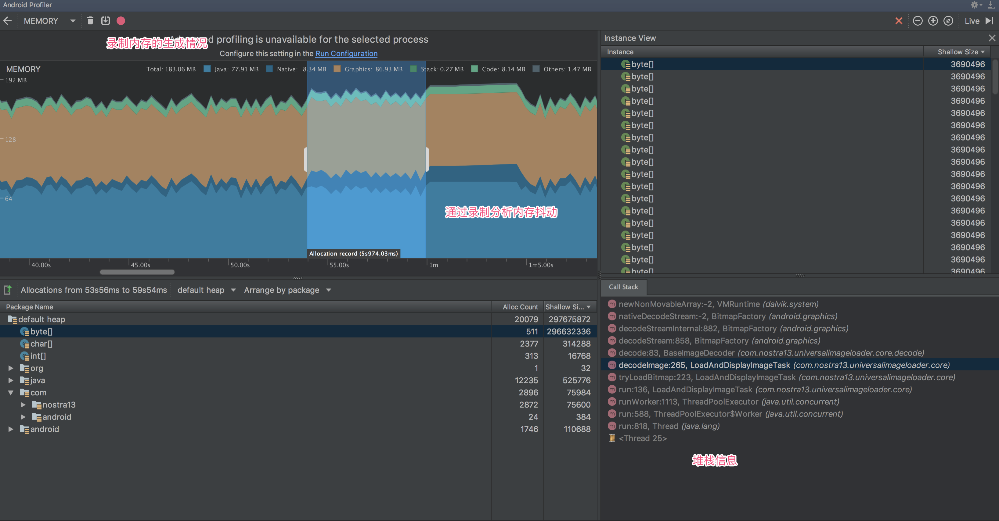