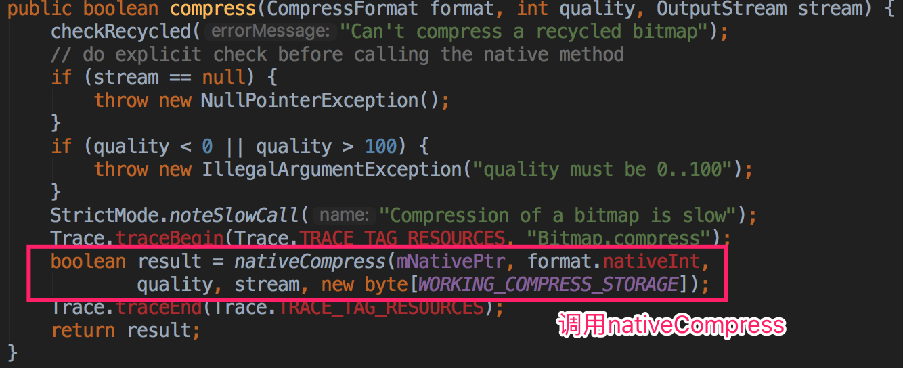
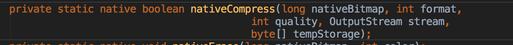
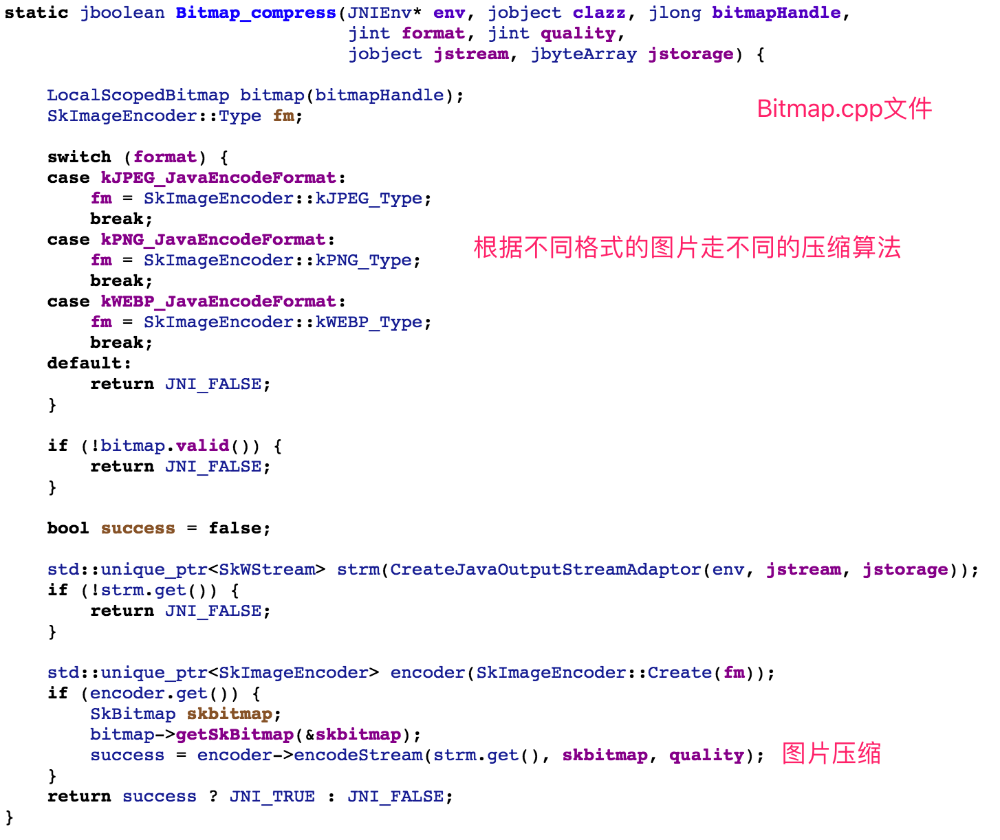
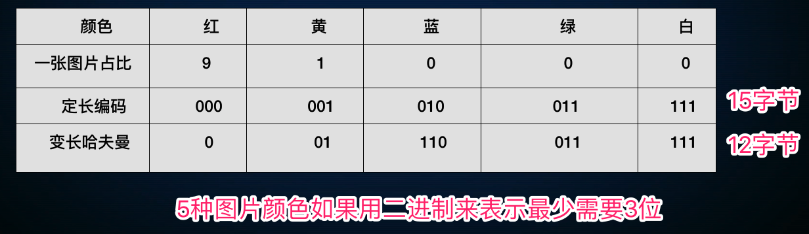
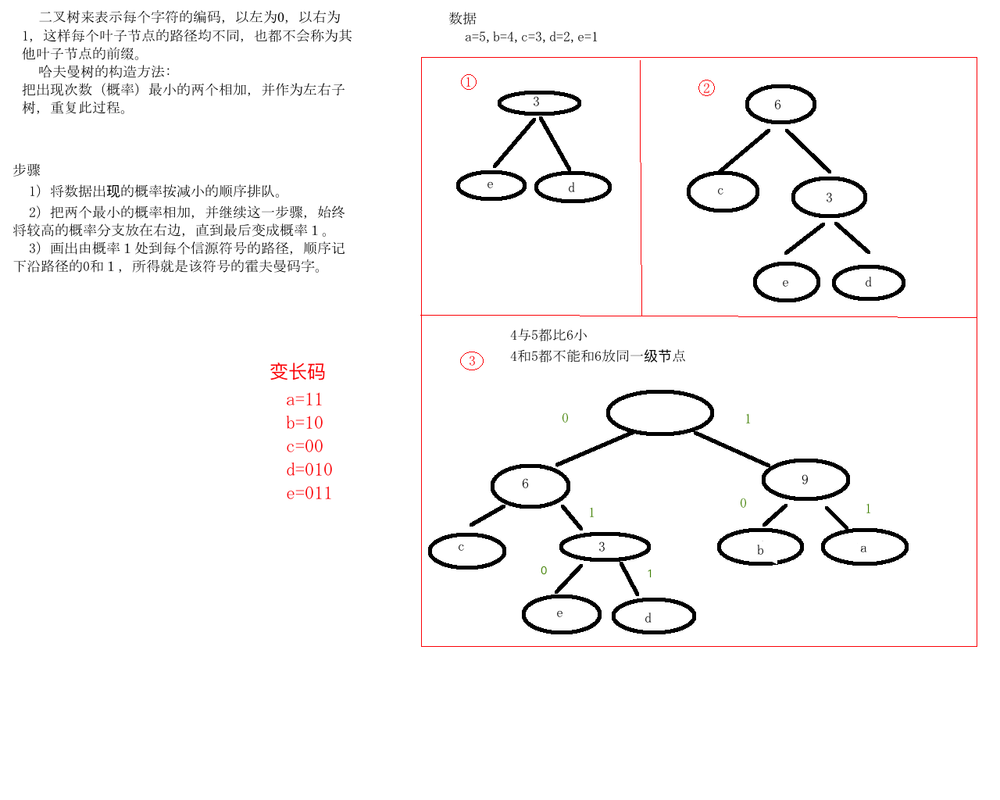

# 图片压缩

## 文件压缩方式

### 质量压缩


- 质量压缩也是清晰度的压缩。它牺牲掉了一些画面细节，这些丢失的细节或许可以被肉眼观察到，这种压缩也叫有损压缩

### 尺寸压缩


- 尺寸压缩就是图片宽高的减小。图片宽高减小了，图片文件大小也就减小了

### 采用率压缩


### 格式选择: JPEG / WEBP (Android 4.0 以上)

- jpeg比png压缩率高，webp压缩率一般比jpeg高


## 压缩原理

- Bitmap 类中 compress 方法

  

- 将调用 native 方法

  

- 调用 Bitmap.cpp 文件

  

## Skia

- 定义

  [https://skia.org/index_zh](https://skia.org/index_zh)

  Skia是一个开源的二维图形库，提供各种常用的API，并可在多种软硬件平台上运行。谷歌Chrome浏览器、Chrome OS、安卓、火狐浏览器、火狐操作系统以及其它许多产品都使用它作为图形引擎

  在 Android 早期版本,使用的是阉割版的 skia (CPU资源紧张) ,对 JPEG 的处理基于 libjpeg , 对 png 则是基于 libpng , 将 libjpeg 中最优哈夫曼算法关闭了,直到 7.0 版本才打开

## 哈夫曼算法

- 常用于数据文件压缩,压缩率通常在20%~90%之间

- 思想

  - 采取可变长编码方式，对文件中出现次数多的字符采取比较短的编码，对于出现次数少的字符采取比较长的编码，可以有效地减小总的编码长度

    

    

## 如果让 Android 7.0 下的手机使用哈夫曼算法

### LibJpeg-turbo

- C 语言编写的 JPEG 编解码库
- 使用步骤 (详细参考 github 中 readme 内容)
  - 下载
    [https://libjpeg-turbo.org/](https://libjpeg-turbo.org/)

    [github release地址](https://github.com/libjpeg-turbo/libjpeg-turbo/releases)

  - 编译支持Android CPU架构的库

    ```
    1. 解压 LibJpeg-turbo
    	tar xvf 1.5.3.tar.gz
    2. 如果需要编译 x86 环境,需要下载 NASM , 否则跳转到第三步 
    	2.1 解压
    		tar xvf nasm-2.13.tar.gz
    	2.2 编译
    		切换到 nasm 目录
    		运行configure,生成 makefile 文件 ( ./configure )
    		执行命令 make install
    ```

    ​

  - As集成

  - 编码