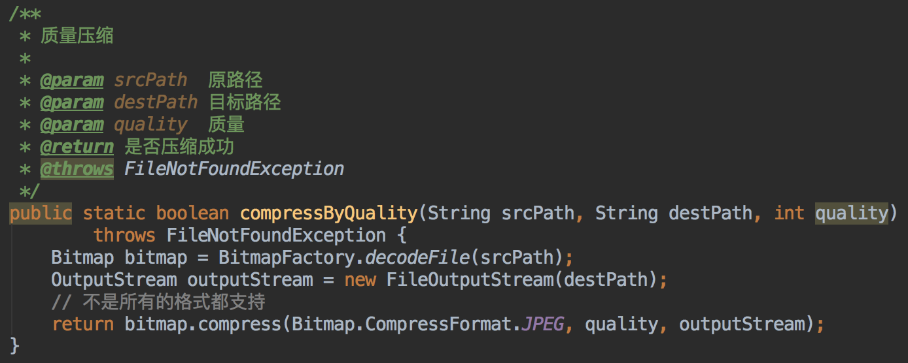
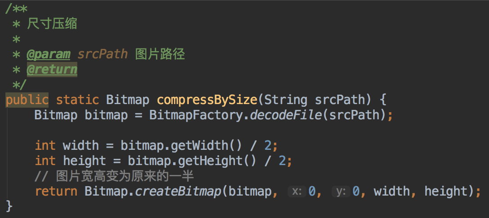
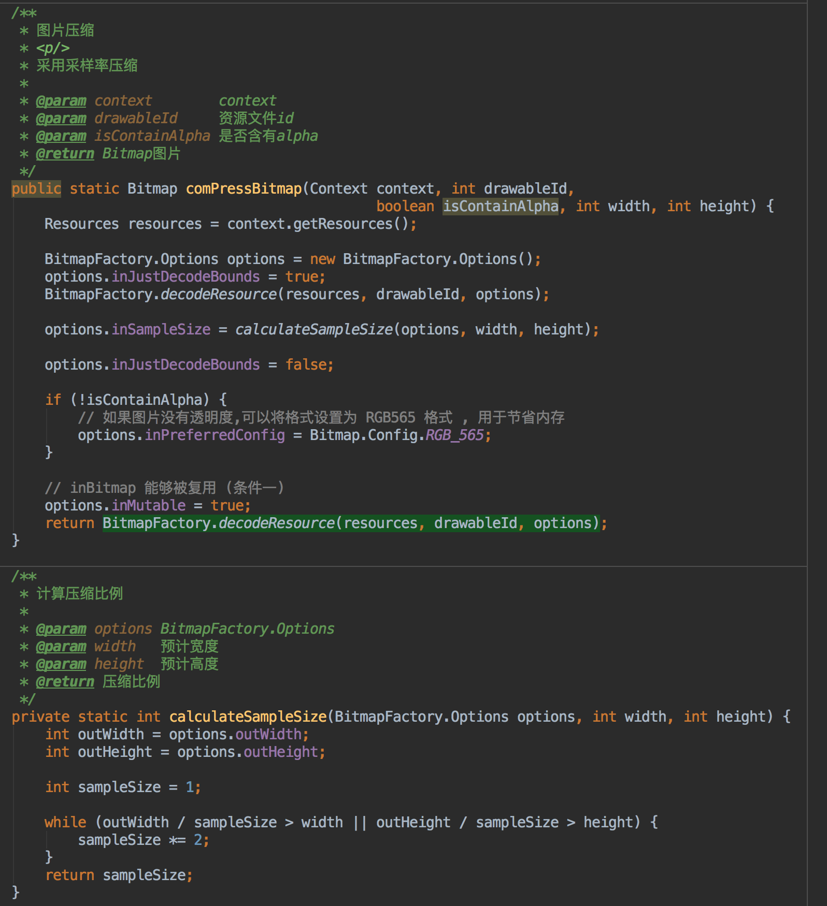
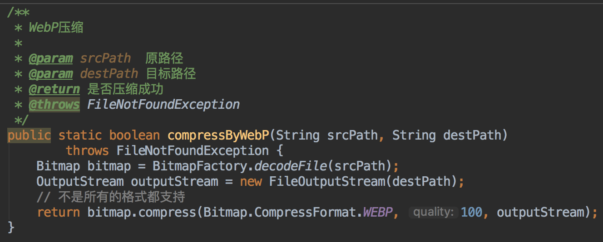

# 图片压缩

## 文件压缩方式

### 质量压缩

- 质量压缩也是清晰度的压缩。它牺牲掉了一些画面细节，这些丢失的细节或许可以被肉眼观察到，这种压缩也叫有损压缩

### 尺寸压缩

- 尺寸压缩就是图片宽高的减小。图片宽高减小了，图片文件大小也就减小了

### 采用率压缩

### 格式选择: JPEG / WEBP (Android 4.0 以上)

- jpeg比png压缩率高，webp压缩率一般比jpeg高

