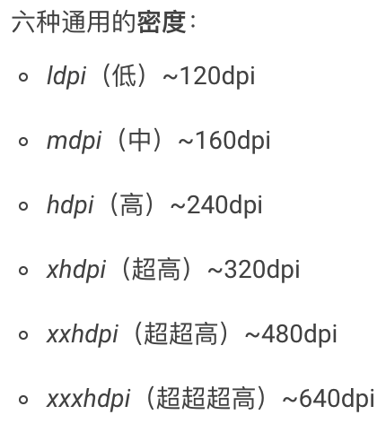

# Bitmap内存压缩

## 内存占用

- ARGB_8888

  ARGB各占8位 , 每个像素4个字节 , 图片的总字节数为 WIDTH * HEIGHT * 4

- RGB_565

  R5位 , G6位 , B5位 , 即16位 , 每个像素2个字节,图片的总字节数为 WIDTH * HEIGH * 2

- 获取返回可用于存储此位图像素的最小字节数

  ```java
  getByteCount
  ```

- 在 Android 3.0 之下 , Bitmap 内存是在 native 进行申请的 , 3.0 及 3.0 之上 , 内存是在 Java 进行申请的 ,  但在 8.0 系统 , 内存又移动到 native 层

- getAllocationByteCount 与 getByteCount 的区别

  - 一般情况下 getByteCount() 与 getAllocationByteCount() 是相等的
  - 通过复用 Bitmap 来解码图片，如果被复用的 Bitmap 的内存比待分配内存的 Bitmap 大,那么getByteCount() 表示新解码图片占用内存的大小 ( 并非实际内存大小 , 实际大小是复用的那个 Bitmap 的大小 ) ，getAllocationByteCount() 表示被复用Bitmap占用的内存大小 . 所以可能allocation比bytecount大


### BitmapFactory.Options

- 作用:控制解码图片参数

- inDensity

  - 表示 Bitmap 的像素密度, 根据 drawable 目录

    

  - 一张图片,如果位置放置错误的情况下,加载图片所占用的内存可能会增加

- inTargetDensity

  - 表示要被画出来时的目标(屏幕)像素密度

- inPreferredConfig

  - 加载图片的格式

    - 对于一个没有透明度的 png 来说 , 加载的时候设置

      ```java
      BitmapFactory.Option option = new BitmapFactory.Option();
      option.inPreferredConfig = Bitmap.Config.RGB_565;	// 使用 RGB565 格式
      ```

      会更加节省内存

- 加载图片会根据 inDensity 和 inTargetDensity 两个值对图片进行缩放

## LruCache

- 初始化

  

## inBitmap 复用

- 优点

  

- 注意点

  - 被复用的 Bitmap 必须设置 inMutable 为 true

    ```java
    BitmapFactory.Option option = new BitmapFactory.Option();
    option.inMutable = true;
    ```

  - 只有在 Android 2.3.3 之后版本才可以使用该属性 

  - 在 Android 4.4 ( API 19 ) 之前 , jpg , png , 必须保持同等宽高 (获取的 Bitmap 的宽高与初始 Bitmap 的宽高必须保持一致 ) , inSampleSize = 1 的 Bitmap 才可以被复用

  - 在 Android 4.4 之前 , 被复用 Bitmap 的 inPreferredConfig 会覆盖待分配内存的 Bitmap 设置的 inPreferredConfig

  - 在 Android 4.4 之后 , 被复用的 Bitmap 内存必须大于等于需要 Bitmap 申请的内存 (获取的 Bitmap 内存 必须小于初始 Bitmap 内存 )

## LruCache

- 简介

  - Android 提供的一个缓存工具类 , 使用 LRU 缓存淘汰算法
  - 根据历史访问记录来进行淘汰数据 , 如果一个数据被经常访问 , 那么这个数据的存活时间会非常高

- 原理

  - 内部数据结构

     LinkedHashMap

  - 添加数据 ( put )

    - 先获取 key 的大小 , 通过调用 sizeof 方法
    - 将数据存储至 map 中 , 假如之前存在相同 key 的数据 , 将之前的数据进行返回
    - 之前的旧数据由于被替换,需要进行清除 , 会调用 entryRemove 方法
    - 如果当期所有数据的大小已经超出预定的最大值 , 则从 map 中获取 使用最少的数据 ( eldest 方法)
    - 将使用最少的数据进行清除 ( entryRemove 方法 )

  - 获取数据 ( get )

    - 如果从 map 中寻找到 key 值对应的 value , 如果寻找到数据 , 直接返回该数据 ( 由于 LruCache 初始化 LinkedHashMap 时 , 将排序的开关打开 , 数据的移位是由 LinkedHashMap 来完成的  )
    - 如果从 map 中寻找不到 key 值对应的 value , 会调用 create 方法 , 用于提供默认值 , 使用 LruCache 时可以复写 create 方法提供一个默认值 , 如果这个默认值不为空 , 会把这个值存储到 map 中 ( 流程类似于 put 操作 )

## DiskLruCache

- 磁盘缓存

  - github

    [gitbhub 地址](https://github.com/JakeWharton/DiskLruCache.git)

- 使用

  - 初始化

    

  - 从磁盘缓存取文件

    
